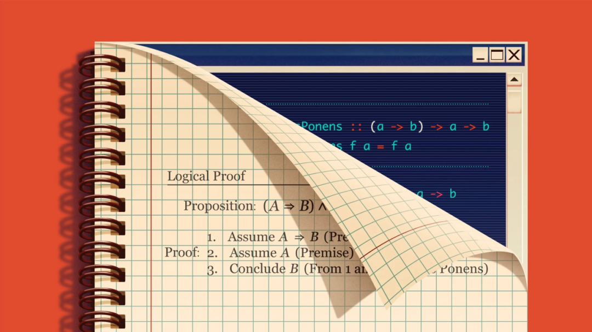

数学逻辑和计算机程序代码之间，以一种精确的方式互为镜像。

一些科学发现之所以重要，是因为它们揭示了某些全新的事物，比如DNA的双螺旋结构，或者黑洞的存在。而另一些发现之所以深刻，是因为它们表明过去被认为截然不同的两个旧概念实际上是等价的。例如，詹姆斯·克拉克·麦克斯韦的方程组统一了电和磁这两个看似不同的现象，而广义相对论则将引力与时空弯曲联系在了一起。

柯里-霍华德对应关系（Curry-Howard correspondence）所做的就是在更大的范围内建立起这样的联系，它不仅将彼此独立的概念联系了起来，更是跨领域地在计算机科学和数学逻辑这两个学科之间建立起了关联。柯里-霍华德同构（这一数学术语表示两个对象之间存在某种一一对应关系）告诉我们，数学证明和计算机程序之间存在一种深刻的关联。

这种关联，简单来说，就是计算机科学中的类型与程序这两种概念分别与数学逻辑中的命题和证明等价。

柯里-霍华德对应的一个潜在影响是，编程这一通常被视为个人工作技能的行为，被提升到了数学那样的理想化高度。写程序不再仅仅是在“编码”，它更可以被视为一种证明数学定理的行为。这使编程行为被形式化，并提供了用数学方法来推理程序正确性的途径。

**编写程序不仅仅是“写代码”，也是在证明定理。**

这一对应关系是以发现它的两位研究人员的名字命名。1934年，数学家兼逻辑学家哈斯凯尔·柯里（Haskell Curry）注意到了数学中的函数和逻辑中的蕴涵关系之间的相似性，后者采取“如果-则”语句的形式将两个命题连接在一起。

受柯里的观察启发，数学逻辑学家威廉·阿尔文·霍华德（William Alvin Howard）在1969年发现了计算和逻辑之间更深层的联系，指出运行计算机程序与简化逻辑证明非常相似。当计算机程序运行时，每一段代码都会被“演算”以产生单个输出。类似地，在数学证明过程中，你从复杂的语句开始，可以通过消除冗余步骤等方式将其简化（例如用更简单的表达式替换复杂的表达式），直到得出一个结论——从许多临时语句推导出的更精简和简明的语句。

虽然这种描述传达了对应关系的一般意义，但要完全理解它，我们需要学习一下计算机科学家所说的“类型论”。

让我们从一个著名的悖论开始：在一个村子里，有一个理发师，他为所有不自己理发的人理发，也只为这些人理发。那这个理发师自己为自己理发吗？如果答案是肯定的，那么他就不应该为自己理发（因为他只为不自己理发的人理发）；而如果答案是否定的，那么他就应该为自己刮胡子（因为他为所有不自己理发的人理发）。这是伯特兰·罗素（Bertrand Russell）在试图用“集合”这一概念来构建整个数学系统的基础时所发现的悖论（理发师悖论）的非正式版本。也就是说，要定义一个由所有不包含自身的集合所构成的集合而不陷于自相矛盾是不可能的。

为了避免这类悖论，罗素提出，我们可以引入“类型”这一概念。粗略地说，这是一种以对象（object）为元素的范畴（category）。例如，如果一个类型叫作“自然数”，那它的对象就是1、2、3等自然数。研究人员通常使用冒号来表示一个对象的类型。数字7的类型为整数，因此可以写为“7:整数”。你可以定义一个函数，它以类型A的对象作为输入，输出类型B的对象，或者是一个将类型A和类型B的对象对组合成一个新类型“A × B”的函数。

要解决前面所提的理发师悖论，一个可行的方案是将不同的类型分成不同的等级，而一个集合中元素的类型等级必须比该集合自身的类型等级要“低级”，这样的集合才是允许的。这么一来集合就不可能包含自身，从而避免了会引起理发师悖论的自指。

在类型论的世界里，证明一个命题为真的过程看起来可以与我们习以为常的过程截然不同。如果我们想证明整数8是偶数，那么就是要证明8确实是一个特定类型“偶数”的对象，其成员资格的规则是能被2整除。在验证8可以被2整除之后，我们可以得出结论，8确实是“偶数”这个类型的一个“成员”。

柯里和霍华德证明，类型在本质上与逻辑命题等价。当一个函数“属于”一个类型时——也就是说，当你能够成功定义一个是该类型对象的函数时——你就成功地证明了对应命题为真。因此，将输入类型A映射到输出类型B的函数，其类型为“A → B”，必然对应了一个蕴涵关系：“如果A，则B”。例如，考虑命题“如果在下雨，则地面湿润”。在类型论中，这个命题将被建模为一个具有类型“下雨 → 地面湿润”的函数。这两者虽然看上去好像很不相同，但在数学上却是等价的。

尽管这种联系听起来很抽象，但它不仅改变了数学和计算机科学从业者对他们工作的看法，而且在这两个领域都带来了几个实际应用。对于计算机科学，它为软件验证提供了理论基础，而软件验证是确保软件正确性的过程。通过用逻辑命题表达期望的行为，程序员可以在数学上证明程序的行为如预期。它还为设计更强大的函数式编程语言提供了坚实的理论基础。

而对于数学，这一对应关系导致了证明助理（也称为交互式定理证明器）的诞生。定理证明器是帮助构造正式证明的软件工具，比如Coq和Lean。在Coq中，证明的每个步骤本质上都是一个个程序，并通过类型检查算法来检查证明的有效性。数学家还利用证明助理（特别是Lean定理证明器）来形式化数学体系本身，这涉及以严格的、可计算机验证的形式来表示数学概念、定理和证明。这使得数学证明过程中有时会出现的那些不那么严谨的语句可以被计算机检查出来。

研究人员仍在深入探索数学和程序之间的相关性。最初的柯里-霍华德对应关系将程序与一种叫做直觉主义逻辑的逻辑融合在一起，但更多其他类型的逻辑也可能最终被统一进来。

“自柯里的洞察以来的一个世纪里，我们不断发现越来越多的‘逻辑系统X对应计算系统Y’的实例。”康奈尔大学计算机科学家迈克尔·克拉克森（Michael Clarkson）说。研究人员已经将编程与其他类型的逻辑（如包含“资源”概念的线性逻辑和处理可能性和必然性概念的模态逻辑）联系起来。

而且，尽管这种对应关系以柯里和霍华德的名字命名，但绝不是只有他们发现了这种关系。这也恰好反映了对应关系背后更深层次的基础本质：人们不断地重新发现它。“计算与逻辑之间存在深层联系，这似乎并非偶然。”克拉克森说。

---

**译者插一句：**

这种映射关系及其后续在越来越多的程序与逻辑系统中的发掘，不由让人想到最初的AdS/CFT对偶以及后来的Gravity/Gauge对偶。